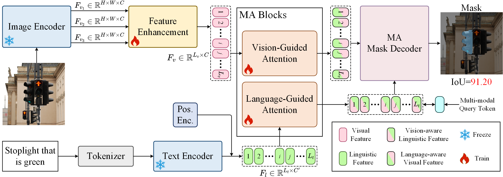

# MARIS: Referring Image Segmentation via Mutual-Aware Attention Features
The official code of MARIS. We will public our code once the paper is accepted.
## The Baseline of MARIS

## Visualization Comparison of MARIS

